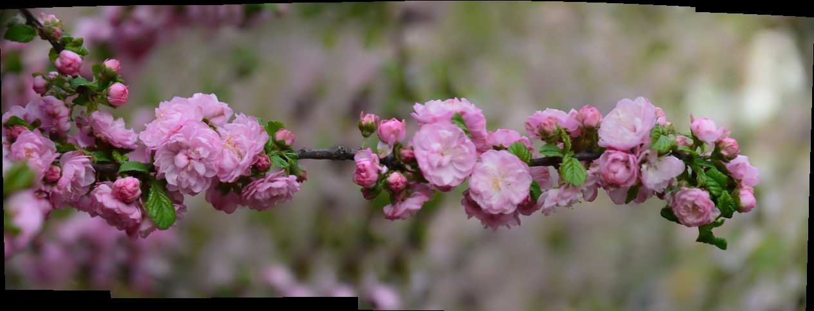

#数字全景图像拼接
这是使用OpenCV自带的stitch类写的一个全景拼接的小工具。对于喜欢造轮子，希望自己从头到尾编写一个全景拼接的，了解内部原理的，请参考吴育昕的[程序](https://github.com/ppwwyyxx/panorama "autopano")和[post](http://ppwwyyxx.com/2016/How-to-Write-a-Panorama-Stitcher/)。

##依赖库
- OpenCV 2.4.9
- SIFT（有专利限制）

##效果

##问题列表

**某些截图无法拼接**

这只是个实验性工程，图片之间有重复的情况下才能够完成拼接。对以下情况无能为力

- 手机截图

